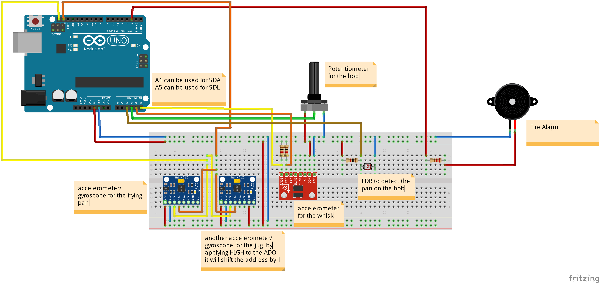

# comp140-worksheetB
### Part A
For my Arduino project I would like to create a pancake cooking/flipping simulator. 
The player will be in control of 2 frying pans and 2 hobs, a jug and a whisk. 
The frying pans will be use to flip the pancakes, the hobs to control the cooking temperature,
the jug to pour the mix and a whisk to mix the batter.

The aim will be for the player to make a pancake mixture using the whisk and then pour the mixture into the frying pans using the jug.
The player will then have to cook and flip as many pancakes as they can without burning or even worse setting fire to any.
The more velocity the user applies to the pan the higher the pancake will go and cause it to do more flips.
When the player runs out of pancake mixture, they will have to make a new one and repeat.

If the player burns too many pancakes it will be game over or if any catch fire it will be instant game over.
The player will be scored on how many pancakes they manage to successfully cook and amount flips they achieve 
also the user will be punished when both pans are empty.

The game will consist of 3 modes standard, extreme and time attack

#### Standard
The player will have control of the cooking temperature, using the hobs.

#### Extreme
The player will have no control of the cooking temperature and it will gradually increase over time.

#### Time attack
Same as standard except the user will have to cook as many pancakes as they can over a period of time.

### Part B
Research. (TBD)

The pancake Sim will consist of frying pans for flipping the pancakes a jug for the mix and the whisk to mimic creating the pancake mixture.  There will also be hobs to control the cooking temperature and fire alarm for the case of the user setting fire to a pancake.

For the design of the controller there will be a compact cooking top to house the frying pans and jug. On the front of the cooking top will be potentiometers for the nobs to control the cooking temperature. The frying pan will use a accelerometer/gyroscope to detect if the user is flipping the pancake and a light dependent resistor to detect if the frying pan is on the cooking top. I will also use accelerometer/gyroscope to track the movement and pour for the jug. The whisk will also house an accelerometer to detect if the player is whisking. For the fire alarm I will use a siren (with a 1k resistor to prevent it from being deafening) 

The circuit will be set up something like this

