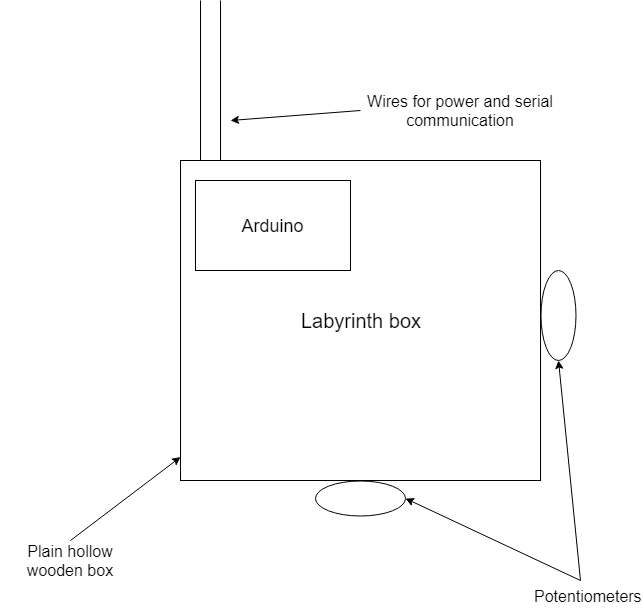

# comp140-worksheetB

# Part A

## Ultimate labyrinth
Ultimate labyrinth brings the classic labyrinth game to your computer, allowing for multiple levels and challenges whilst still maintaining the classic controlls.

## Mechanics
The game will play out just like the normal labyrinth game. Where the player has to follow the predefined path marked out with a black line to the end of the maze without falling victim to the unforgiving and treterous black holes which scatter their path. If the misfortune occurs of their ball falling down one of the holes, they have to start again from the start.

There will be a time trial mode where each map will have a time to beat which has been set by the creator of the game. A hardcore mode will also be added where you only have one life (cannot fall down any holes) to get through as many levels as possible. 

On casual mode, you will be able to keep track of fastest times and least mistfortunes to complete a level to see if you are getting better or not. Without the added stress/pressure of the other modes.

#Part B

## Research

## Description
The controller will be made up of a wooden box with a potentiometer on the front and right. The front one will control tipping left/right whereas the one on the right will control tipping up/down.

## Design

Format: 

The arduino will be hidden inside the wooden box with the only two visible electronics being the wires out the back and the two potentiometers, one on the front, the other on the right.

Finally there will be a gyroscope inside which can be toggled on and off by a button on top, the state of which will be indicated by an LED on top next to the button. This will allow the user to switch between the traditional pivot movement system and a more involving movement in which you roll the ball my tilting the board physically.
